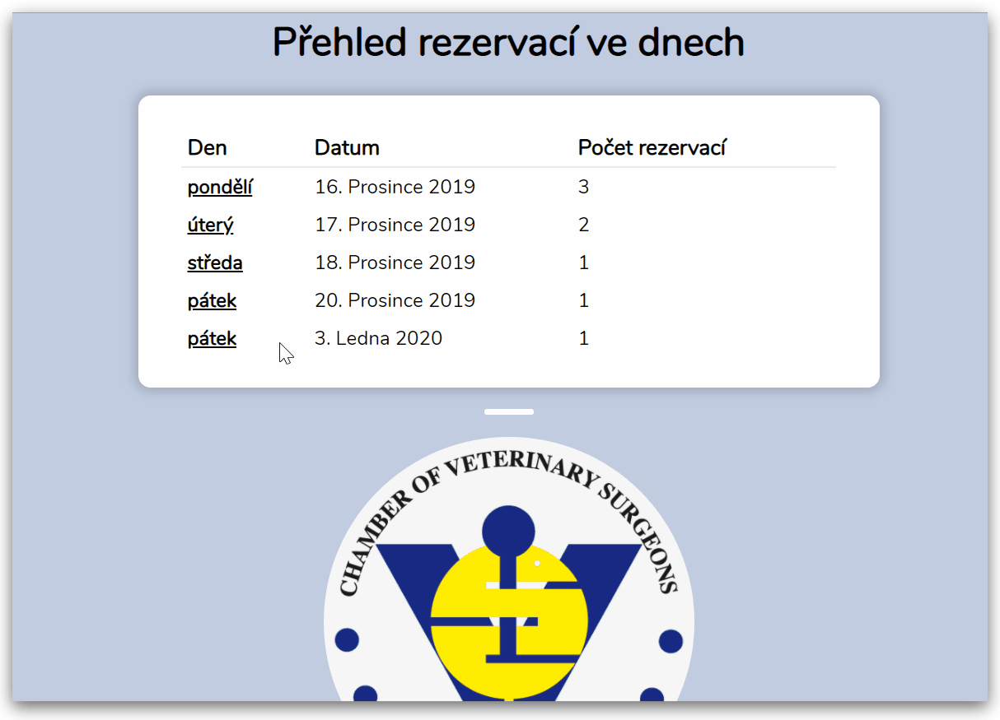
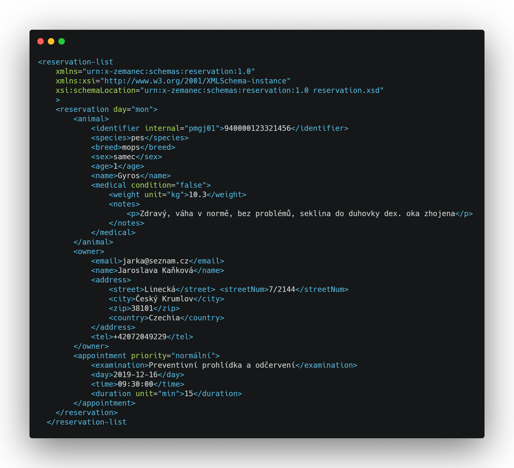

# 🐈 🐶 Veterinary appointment booking registry 🐕 🐢

Solution for easy visual overview of veterinary reservations, medical information and owner profiles. Built only with XML based technologies.

## How it works

Based on incoming data in XML format, specified and validated by *XML schema*, app transforms XML to styled HTML pages using *XSLT* and styled PDF document generated with *XSL-FO*.

example XML:

## Generated page types
* reservation overview for a time interval 
* reservation list for a day
* client profile
* animal profile

## Documentation 

Brief documentation and summary of the solution utilizes *DocBook* namespace, transforming XML markup into navigatable HTML and PDF.

Documentation includes:

* business requirements 
* core XML element meanings
* Notable code constrcuts
* Technology description
  * XML
  * XML Schema
  * XSLT
  * XSL-FO
